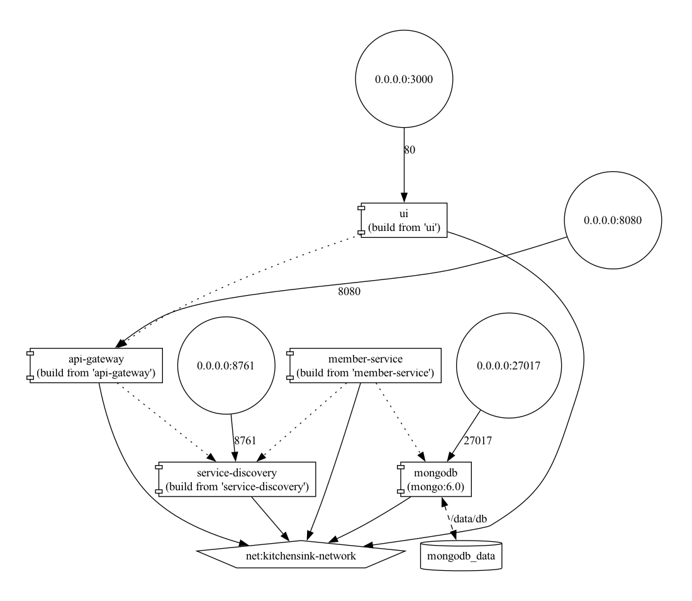

# Kitchensink Microservices

This project is a modernized version of the JBoss EAP Kitchensink application, migrated to a Spring Boot microservices architecture with MongoDB as the database. The application is containerized with Docker for easy deployment and scalability.



## Project Structure

The project consists of the following components:

- **Service Discovery** (Eureka): Handles service registration and discovery, allowing services to find and communicate with each other without hardcoded URLs
- **API Gateway** (Spring Cloud Gateway): Provides a single entry point for all client requests, handles routing, load balancing, and circuit breaking
- **Member Service**: Core service for member management with MongoDB backend
- **UI**: React-based frontend application for user interaction
- **MongoDB**: NoSQL database for storing member data

## Prerequisites

- Java 21 (JDK 21)
- Maven 3.8+
- Docker and Docker Compose
- Git

## Quick Start

The fastest way to get the application running is using Docker Compose:

```bash
# Clone the repository
git clone https://github.com/angansen/kitchensink-modernized-.git
cd kitchensink-modernized-

# Start all services
docker-compose up -d
```

After all services start (which may take a minute or two), you can access:
- UI: http://localhost:3000
- API Gateway: http://localhost:8080
- Eureka Dashboard: http://localhost:8761

## Manual Build and Run

If you prefer to build and run the services manually:

### 1. Build Service Discovery

```bash
cd service-discovery
./mvnw clean package
java -jar target/service-discovery-0.0.1-SNAPSHOT.jar
```

### 2. Build API Gateway

```bash
cd api-gateway
./mvnw clean package
java -jar target/api-gateway-0.0.1-SNAPSHOT.jar
```

### 3. Start MongoDB

You'll need MongoDB running locally on port 27017 or update the configuration in `member-service/src/main/resources/application.yml`.

### 4. Build Member Service

```bash
cd member-service
./mvnw clean package
java -jar target/member-service-0.0.1-SNAPSHOT.jar
```

### 5. Build and Run UI

```bash
cd ui
npm install
npm start
```

## Configuration

### Environment Profiles

The application supports different profiles for various environments:

- **default**: For local development without Docker
- **docker**: For running in Docker containers with proper service discovery

When running with Docker Compose, the Docker profile is automatically activated.

### Port Configuration

| Service | Port | Description |
|---------|------|-------------|
| Service Discovery | 8761 | Eureka server for service registration |
| API Gateway | 8080 | Gateway for routing requests |
| Member Service | 8081 | Core service (not directly exposed) |
| MongoDB | 27017 | Database (not directly exposed) |
| UI | 3000 | Frontend application |

## API Endpoints

### Member Service

| Method | Endpoint | Description |
|--------|----------|-------------|
| GET    | /api/members | Get all members |
| GET    | /api/members/{id} | Get member by ID |
| GET    | /api/members/email/{email} | Get member by email |
| POST   | /api/members | Create a new member |
| PUT    | /api/members/{id} | Update an existing member |
| DELETE | /api/members/{id} | Delete a member |

## Testing the API

You can test the API using curl, Postman, or any API testing tool:

```bash
# Get all members
curl -X GET http://localhost:8080/api/members

# Create a new member
curl -X POST http://localhost:8080/api/members \
  -H "Content-Type: application/json" \
  -d '{
    "name": "John Doe",
    "email": "john.doe@example.com",
    "phoneNumber": "1234567890"
  }'

# Get member by ID (replace {id} with an actual ID)
curl -X GET http://localhost:8080/api/members/{id}

# Update a member (replace {id} with an actual ID)
curl -X PUT http://localhost:8080/api/members/{id} \
  -H "Content-Type: application/json" \
  -d '{
    "name": "John Doe Updated",
    "email": "john.doe@example.com",
    "phoneNumber": "1234567890"
  }'

# Delete a member (replace {id} with an actual ID)
curl -X DELETE http://localhost:8080/api/members/{id}
```

## Monitoring and Management

The application includes Spring Boot Actuator for monitoring:

- API Gateway health: http://localhost:8080/actuator/health
- Member Service health: http://localhost:8081/actuator/health
- Service Discovery health: http://localhost:8761/actuator/health

## Scaling

To scale the Member Service horizontally:

```bash
docker-compose up -d --scale member-service=3
```

The API Gateway will automatically load balance requests across all instances of the Member Service.

## Troubleshooting

### Service Discovery Issues

If services can't discover each other:

1. Check if Eureka server is running: http://localhost:8761
2. Verify that services are registered in Eureka dashboard
3. Check service logs for connection errors:
   ```bash
   docker logs service-discovery
   docker logs api-gateway
   docker logs member-service
   ```

### API Gateway Routing Issues

If API requests are failing:

1. Check if the API Gateway is running: http://localhost:8080/actuator/health
2. Verify that the Member Service is registered with Eureka
3. Check API Gateway logs for routing errors:
   ```bash
   docker logs api-gateway
   ```

### Database Issues

If MongoDB connection fails:

1. Check if MongoDB container is running:
   ```bash
   docker ps | grep mongodb
   ```
2. Check Member Service logs for database connection errors:
   ```bash
   docker logs member-service
   ```

## Stopping the Application

To stop all services:

```bash
docker-compose down
```

To stop and remove all containers, networks, and volumes:

```bash
docker-compose down -v
```

## Architecture Details

### Service Communication

- Services register themselves with the Eureka server
- The API Gateway uses Eureka to discover service instances
- Client requests go through the API Gateway which routes them to the appropriate service
- Services communicate with each other using their service names (in Docker) or localhost (in local development)

### Resilience Patterns

- **Circuit Breaker**: The API Gateway implements circuit breaking to prevent cascading failures
- **Fallback**: If the Member Service is unavailable, the API Gateway returns a fallback response

## Contributing

1. Fork the repository
2. Create a feature branch: `git checkout -b feature/your-feature-name`
3. Commit your changes: `git commit -am 'Add some feature'`
4. Push to the branch: `git push origin feature/your-feature-name`
5. Submit a pull request
